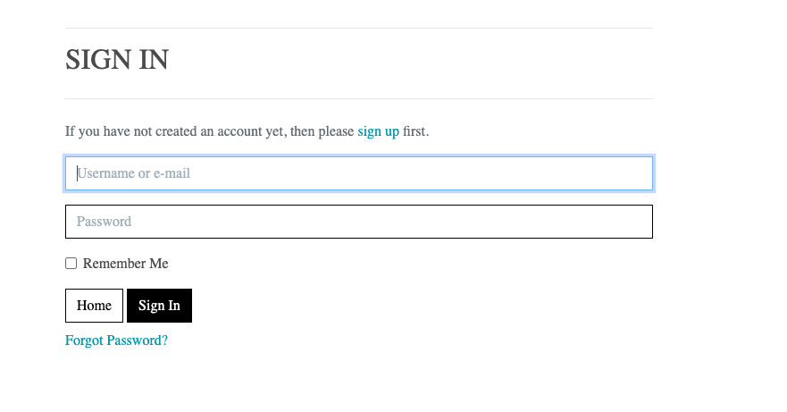

## Purpose of the project
___
   * The purpose of the project is to create an e-commerce site to apply all knowledge gained thorugh the course. The site is built using django. 
   *The site represent a ficticious gym that offers subscriptions,Personal Trainer plans and meal plans. 

## Personas 

For this project we have identified the following personas based on the expected usage of the site: 
- Visiting user: 
  - This persona is still not a client and is just gathering information or browsing the site before commiting. 
- Registered User/Shopper 
  - This person is ready to commit to a purchase or has already purchased one item and it is a recurring shopper 
- Business Owner
  - This persona is a business owner or admin that will control the site and access to parts like reviews, contact form queries, etc..

## User Stories
| User Story                                                                           | Ticket Number |
| :-----------                                                                         | :----:       |
|            Visiting User                          |
|          #2                               |  As a visiting user I can browse the site   |
|          #7                    |   As a visiting user I want to browse the products  |
|           Shopper                           |
|          #13                               |   As a shopper I wan to add products to the bag    |
|          #29                      |  As a shopper I can adjust the bag before paying for it    |
|          #29                                |   As a shopper I can checkout to pay for the items    |
|          #67             |   As a shopper I can leave comments in products    |
|                                Business Owners       |
|          #32                      |   As a business ower I can review and adjust the ordesr so that I can have visibility on my clients purchases   |
|           #52                     |  As a business owner I can add new products so that I can keep updating my site   |
|           #86                    |   Story As a business owner I am able to see the contact enquiries   |
|                                |      |
|                                |      |
|                                |      |

## Features
___
   *  Ability to browser the site. [#2](https://github.com/rfpotrero/fitbodies/issues/2)
      * The landing page will be display as the first thing the visiting see. 
   *  Ability Register in the site [#43](https://github.com/rfpotrero/fitbodies/issues/43)
      * The will register in the site using the links under My Account
      
   *  Ability to login to the site. [#43](https://github.com/rfpotrero/fitbodies/issues/43)
      
   *  Ability Request a new password [#43](https://github.com/rfpotrero/fitbodies/issues/43)
      
   *  Ability to shop by categories under the Store link [#7](https://github.com/rfpotrero/fitbodies/issues/7)
      * Clicking in the Store nav-bar link will display the categories
      
   *  Ability to view product details [#7](https://github.com/rfpotrero/fitbodies/issues/7)
      * Clicking in the product displays a full description of the item
      
   *  Ability to add items the shopping bag [#20](https://github.com/rfpotrero/fitbodies/issues/20)
      * The shopper can add product to the bag and going to checkout or keep shopping
      * 
   *  Ability to remove items from the shopping bag [#20](https://github.com/rfpotrero/fitbodies/issues/20)
      * The shoper can remove items from the bag
      
   *  Ability to see the items in the shopping bag [#20](https://github.com/rfpotrero/fitbodies/issues/20)
      * The shopper can view the items in the back return to keep shopping.
      
   *  Ability to go to checkout to enter their details [#29](https://github.com/rfpotrero/fitbodies/issues/29)
      * The shopper can proceed to checkout and enter their details there
      
   *  Ability to proceed to payments [#29](https://github.com/rfpotrero/fitbodies/issues/29)
      * The shopper can proceed to payment 
      
   *  Ability to see and update their personal information [#43](https://github.com/rfpotrero/fitbodies/issues/43)
      * The registered user is able to see their save information
      
   *  Ability to see old orders [#43](https://github.com/rfpotrero/fitbodies/issues/43)
      * The registered user is able to see their past orders
      
   *  Ability to track and update their progress [#59](https://github.com/rfpotrero/fitbodies/issues/59)
      * The registered user is able to enter their progress goals
      
   *  Ability to track see their reviews [#67](https://github.com/rfpotrero/fitbodies/issues/67)
      * The registered user is able to see alll their reviews and update or delete them
      
   *  Ability to update their review [#67](https://github.com/rfpotrero/fitbodies/issues/67)
      * The registered user is able to update their reviews
      
   *  Ability to delete their review [#67](https://github.com/rfpotrero/fitbodies/issues/67)
      * The registered user is able to delete their reviews
      
   *  Ability to Contact the business via form [#79](https://github.com/rfpotrero/fitbodies/issues/79)
      A visiting or register user can use the contact form to reach the business
      
   *  Ability to add new product to the site  [#59](https://github.com/rfpotrero/fitbodies/issues/59)
      * An admin can add new products to the site. 
      
   *  Ability to adjust existing product on the site [#13](https://github.com/rfpotrero/fitbodies/issues/13)
      * An admin can modify existing products
      
   *  Ability to see the contact enquiries [#86](https://github.com/rfpotrero/fitbodies/issues/86)
      * An admin can see the contact enquiries
      
   *  Ability to adjust orders [#32](https://github.com/rfpotrero/fitbodies/issues/32)
      * An admin can update orders
      
   *  Ability view reviews [#32](https://github.com/rfpotrero/fitbodies/issues/32)
      * An admin can see the reviews and update if required
      

## Future features
___
   * Ability to book specific classes 
   * Ability to book sessions with the PT

## Marketing Stategies
___

### Search Engine Optimization (SEO)

* Wordtracker and Google Keyword planner were used to increase ranking and curate the list of keywords used. A combination of short and long tail keyworks were used.

## Content Marketing 
* The gym does not have a blog of something that generated a big amount of articles for content Marketing however this happenig in he class description, the personal trainer section and product description. 

## Social Media
* The facebook page will be used to generate interested and to build community by running events and showing the classes to encourage more people to join. This communit will grow organically and will required care during the early stages with automated post and frequent 
interaction to generate engagement. 

* Facebook Business also have option to boots their ads to increase reach targetting by interests, age, demographic, location, etc..this ideal for the business since it is location dependant and focus a very specific target of population. 

* The page Facebook page can be found [HERE](https://www.facebook.com/profile.php?id=100089238622942) and adding a screenshot in case it will be taking down. 
  - 

## Desing and Diagrams
___
   ### Database Diagrams
   * ER diagram 
     
    
   ### Wireframes
   * 
   

## Technology
___
   ### Languages
   * HTML
   * CSS
   * Javascript
   * Python 3.8
  
   ### APIs
   * [Stripe](www.stripe.com)
     * API used to proccess client payments
   * [Amazon](aws.amazon.com) S3 Storage
     * Using amazon S3 Storage to storage media and static files for deployment.
   ### Database
   * PostgresQL. This databased is hostes by [ElephantSQL](https://www.elephantsql.com/)
   ### Framework 
   * Django 4.0
   ### Libraries
   * [Allauth](https://django-allauth.readthedocs.io/en/latest/overview.html)
   * [Crispy Forms]()
   * [Bootstrap 4.4.1](https://getbootstrap.com/docs/4.4/getting-started/introduction/)

## Test Cases 
___
| Test  | Expected Result | Actual Result | Pass/Fail |
| ----- | ----- | ----- |  -----|
| Browse to site |  User wil be directed to the landing page | User is directed to the landing page |**Pass** |
| User Registration | The user should be able to register an account  | The user registration is successful including the email confirmation |**Pass** |
| User Login | User can user their username and passwor to login | The can login correctly using their login and password | **Pass** |
| User Password Reset | The will received and email with a password to reset their password  | The user receives an email with a password reset link |**Pass** |
| Click in the nav links |  User will be directed to specific page |  User is directed to the page clicked| **Pass** |
| Browse to Classes |  User will be directed to the classes | User is directed to the classes page |**Pass** |
| Click in Classes | A modal will popup with more info about the class  | A modal is appearing with info about the class |**Pass** |
| Browse to Contact Us |  User is directed to contact page | The user is directed to the contact page |**Pass** |
| User send a new query |  User receives an email confirming their query | Users can utilise the form to contact the gym |**Pass** |
| Browse to Trainers |  User is directed to the page | The page with the trainers load  |**Pass** |
| Read Trainers Bio |  User can click in Read Bio to further display the bio | The bio appears correctly when the user click in Read Bio |**Pass** |
| DropDown menu for products | User will see the product category dropdown menu  | Is presented with the dropdown menu |**Pass** |
| Display Items per Category | A overlay load and the user see the product's category | The clicked category items appears |**Pass** |
| See a product details |  The product detail view load with extra description | The user is directed to product page with extra description |**Pass** |
| Click in Keep shopping from product detail  | The user is returned to a complete list of products | The user can see the full list of products |**Pass** |
| Add product to the bag | The product will be added to the bag   | The product is aded to be bag and the total updated |**Pass** |
| Remove a product from the bag | The product will disappear from the bag  | The product is removed from the bag and the total updated |**Pass** |
| User Profile | The user should land in their details |They user can see their detail and recent orders | **Pass** |
| View old order | A summary of a previous order will appear | The user can see the summary of previous orders | **Pass** |
| User Profile My Progress | The user can see their profile, empty if there is not one  | The use is able to see their progress and update it | **Pass** |
| User Profile My Reviews | User can see their reviews  | The reviews are displayed |**Pass** |
| Update My Reviews | User update their existing reviews  | The user cna update their update a warning appears before updating |**Pass** |
| Delete My Reviews | User delete their reviews  | The user can delete their review a warning appears before deleting |**Pass** |
| Add review | If they user is logged they can leave a review  | The user can see the submit review area and submit review |**Pass** |

## Code Validators 

  

  
Lighthouse Report

  
  

 
  

  
CSS Validation
 

  
  
  
 

  

  
HTML Validation 

  
  
  
 

  

  
pycodestyle Validation

  
  
  
  
 

## Fixed bugs
___
- Fix image link in product detail #106
  - Since the pictures are based per category rather individual product. This was fixing by rendering the object product.image_url instead of product.image.url
- Progress kilos_to_go field was crashing the view while empty #105
  - When one the values in the kilos_to_go calculation is empty the progress view crashes due the kilos_to_go caculation requiring an int. Adding validation to see if both values exist and if not set kilos_to_go to none. 

## Deployment
___
   - [Heroku](heroku.com) deployment   
     - Browse to heroku and login
     - Upper right corner. Click in New and select New App
     - Choose a Name for the app and a Region
     - Click in your App name if you are not redirect to it. 
     - Click in Settings, under builpacks select: 
       - Heroku/Python
     - Click in Resources
   - [ElephantSQL.com](https://www.elephantsql.com/) database 
      - Navigate [ElephantSQL.com](https://www.elephantsql.com/) and click “Get a managed database today”
      - Select “Try now for FREE”
      - Select “Log in with GitHub” and proceed with authorization
      - Create a database
      - Set up your plan - Tiny Turtle is a free tier
      - In “Select Region” choose the closed to you or your users
      - Click “Review”
      - Click "Create Instance"
   - [Stripe](stripe.com)
      - Click in register and complete the registration process
      - Click in Developers
      - Click in API Keys
      - Writedown the apis as they will be used in the Heroku config below
      - Cick in Webhook
      - Click in Add Endpoint and add https://fitbodies.herokuapp.com/checkout/wh/
      - Take note of the endpoint secret. This will be used in the Heroku Config below
   - [Amazon](aws.amazon.com)
      - Create an amazon account
      - Go to Amazon dashboard and search for S3
      - Create a bucket called fitbodies
      - Select your AWS Region
      - Uncheck "Block all public acess" and check the warning message
      - Navigate to Properties
      - Navigate to Static and click edit
      - Turn On Static Website Hosting
      - Enter index.html and error.html in their respective fields 
      - In Permissions, click edit in the CORS section and enter the [FOLLOWING](assets/documentation/cors.png) configuration
      - Click edit in buckect policy and generate the FOLLOWING policy
      - The above generates a policy with [THIS](assets/documentation/bucketpolicy generator.png) setting. Please note that you will need to enter your own Amazon Resource Name(ARN)
      - Click in Gerate Policy and copy the policy into the [Bucket Policy](assets/documentation/bucket policy.png)
      - Before saving BE SURE to add to add the end of Resource /* as shown [HERE](assets/documentation/awsresource.png)
      - In Access Control List set the List permissions to everyone under Public Access as shown [HERE](assets/documentation/aclall.png)
      - Go to IAM. 
      - On the sidebar click in User Groups
      - Name your group
      - Click on Create Policy
      - Tag are optional but need to proceed to that stage before Review Policy
      - Review Policy and accept
      - On the sidebar click User Groups. Select your group, go to the permissions tab.
      - Open the Add permissions dropdown, and click Attach policies. As shown [HERE](assets/documentation/awspolicies.png)
      - Click in Policies and Create Policy
      - Click in JSON and import the Amazon pre-built policy AmazonS3FullAccess
      - Made tha changes shown [HERE](assets/documentation/awsjsonpolicy.png), including your own ARN 
      - Click in Review Policy. 
      - Set a name and description
      - Click in Create Policy
      - Return to the User Group you have previously created. 
      - Click in Permissions and click in Attach Policy
      - Search for name of the Policy we have just created and selct it. 
      - Click Attach Policy
      - Navigate to Users on the left side of the screen
      - Add User and name it. 
      - In Access Type, select Programatic Access
      - Click Next
      - Add the user the group we had created previously 
      - Click Next, tags are optional
      - Click Create User
      - Download the CSV files with the keys that we will using in heroku. Keep them safe!
      - In your project settings.py include the code [HERE](assets/documentation/awsusage.png) be sure to include a ENV variable called USE_AWS to trigger AWS usager otherwise it will defaul to local. 
   - [Google Mail](gmail.com)
      - Navigate to gmail.com
      - Create an account
      - Click in Manage you google account
      - Click in Security 
      - Enable 2 Step Verification  
      - Click in App Passwords 
      - Click in Select App and select Mail
      - Click in Select Device and select Other
      - Name the app and click in Generate
      - Copy the 16 digits as this will the last time it is showed.
      - In your project settings.py include the [FOLLOWING](assets/documentation/goolesettings.png) code
      - The 16 digits password will be later use in heroku as well
   - Heroku
     - Navigate to Heroku
     - Click in Settings
     - Click Reveal Config Vars
     - In Config Vars click in Add and add the following
       - DATABASE_URL - In ElephantSQL navigate to your instance copy URL and paste it here. 
       - SECRET_KEY - Secret Key from Django
       - PORT - 8000
       - STRIPE_WH_SECRET - Stripe webhook secret key
       - USE_AWS - True
       - AWS_SECRET_ACCESS_KEY - AWS user access key from the amazon download CSV file
       - AWS_ACCESS_KEY_ID - AWS user key ID from the amazon download CSV file
       - EMAIL_HOST_PASS - App password to send email in this case gmail app password
       - EMAIL_HOST_USER - Email selected for sending email
     - Return to your Code Editor where your code lives
     - Create a Procfile
       - Inside enter web: gunicorn alfresco.wsgi
     - In settings.py navigate to ALLOWED_HOST
       - Add heroku APP URL 
     - In settings.py set DEBUG=False
     - Run pip3 freeze >> requirements.txt to ensure packages and libraries are captured.
     - Commit and push your code as needed.
     - Once that is completed. Click in Deploy
       - In Deploy Method clink under GitHub 
       - Connect your Github repository to Heroku
       - At the bottom under Manual Deployment select the Branch you want to deploy. Main by default
       - Click in Deploy Branch
       - Click in the View button to open deployed app.
   * Local deployment
     - Clone the repository 
     - Ensure your ENV variables are correctly setup 
       - os.environ["SECRET_KEY"] = to be completed with your data
       - os.environ["DATABASE_URL"] = to be completed with your data
       - os.environ["STRIPE_PUBLIC_KEY"] = to be completed with your data
       - os.environ["STRIPE_SECRET_KEY"] = to be completed with your data
       - os.environ['STRIPE_WH_SECRET'] = to be completed with your data
       - os.environ["AWS_ACCESS_KEY_ID"]= 'TO BE ADDED BY USER'
       - os.environ["AWS_SECRET_ACCESS_KEY"]= 'TO BE ADDED BY USER'
       - os.environ["EMAIL_HOST_USER"]= 'TO BE ADDED BY USER'
       - os.environ["EMAIL_HOST_PASS"]= 'TO BE ADDED BY USER'
       - os.environ["USE_AWS"]= 'TO BE ADDED BY USER'
     - Run the command pip3 install -r requirements.txt
     - Run the command python3 manage.py makemigrations --dry-run to review if any migration is required.
     - Run the command python3 manage.py migrate to execute the migrations if required
     - In settings.py modify ALLOWED_HOST to resolve any connectivity issues, add localhost. 
     - Run the command python3 manage.py runserver

## Credits
___
   * Official docummenation https://djangoproject.com
   * Bootstrap code https://getbootstrap.com/
   * E-Commerce core functionality by Code Institute boutique Ado
   * Images 